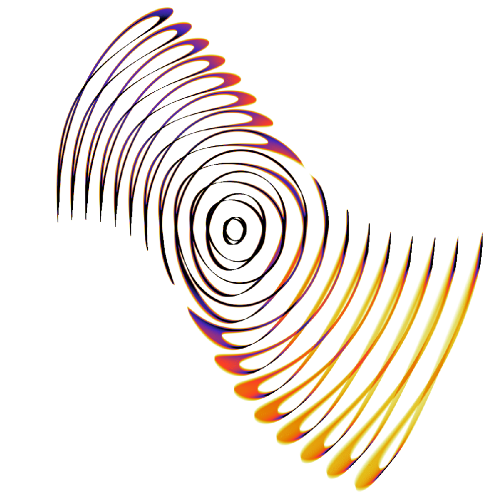

Introduction
============
`SOFT <http://ft.nephy.chalmers.se/~hoppe/soft/>`_ is a synthetic synchrotron diagnostic that can
be applied to study the synchrotron radiation emitted by runaway electrons in tokamaks. By solving
the guiding-center equations of motion in a numeric magnetic equilibrium, the physics of the system
are utilized and allows SOFT to be applied to experimental scenarios.
