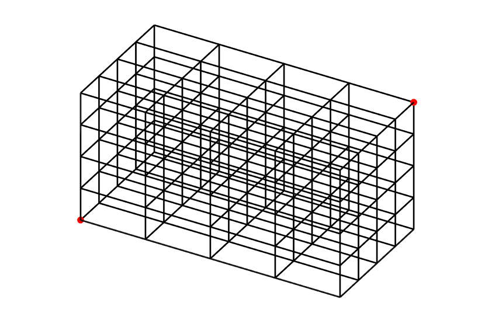

.. _space3d:

3D emission maps
================
Due to the highly anisotropic nature of bremsstrahlung and synchrotron
radiation combined with the fact that radiation is only detected if it's
emitted directly at the detector, a given detector can only measure radiation
from particles in a certain regions of space. It can be shown that these
regions of space all satisfy (approximately) the condition

.. math::
   \hat{\boldsymbol{b}}(\boldsymbol{x})\cdot\frac{\boldsymbol{x}-\boldsymbol{X}}{\left|\boldsymbol{x}-\boldsymbol{X}\right|} = \cos\theta_{\mathrm{p}},
   :label: bdotr

where :math:`\hat{\boldsymbol{b}}` is the magnetic field unit vector,
:math:`\boldsymbol{x}` is the particle's position, :math:`\boldsymbol{X}` is
the detector's position and :math:`\theta_{\mathrm{p}}` denotes the particle's
pitch angle (note that the pitch angle also varies as the particle moves in
the inhomogeneous magnetic field, and therefore picks up a dependence on
:math:`\boldsymbol{x}`). The solution to this equation, i.e. the points
:math:`\boldsymbol{x}` satisfying it, trace out a surface in real space which
we refer to as the `surface-of-visibility`. When the detector is located in
the midplane, this surface typically takes the shape of a twisted cylinder.

Solving for surface-of-visibility
---------------------------------
Using SOFT it is possible to solve :eq:`bdotr`, accounting for the finite
detector size. This is done by adding the sycout ``space3d`` (see
`space3d <paramref.html#space3d>`__ for a parameter reference) to your SOFT
runscript. One example definition of the sycout is as follows ::

  sycout space3d {
      output=outfile.mat
      type=pixels
      pixels=200
      point0=-0.5,-0.25,-0.25
      point1=0.5,0.25,0.25
  }

The ``output`` parameter specifies the name of the output file, and the
``type`` parameter specifies the algorithm to use for storing 3D information.
Setting ``type=pixels`` means SOFT will divide the space into :math:`N^3`
cells, where :math:`N` is the value assigned to the ``pixels`` parameter,
between the two edge points ``point0`` and ``point1`` (see the figure below;
the red dots indicate the locations of the edge points). During the SOFT run,
each cell records the radiation being emitted from the box and accumulates it. 

The other value available for ``type`` is ``real``, which stores the exact
coordinates of each point that contributes to the final image. This means that
the output will be more detailed, but it will also grow with each particle.

Visualizing
-----------
Visualization of space3d files is complicatd by the fact that each point
represents emitted light, which adds together along lines of sights. A simple
C program has been written by Mathias for generating sequences of PNG images
from S3D output files. The program is available on GitHub:
`s3dvid <https://github.com/hoppe93/s3dvid>`__.
